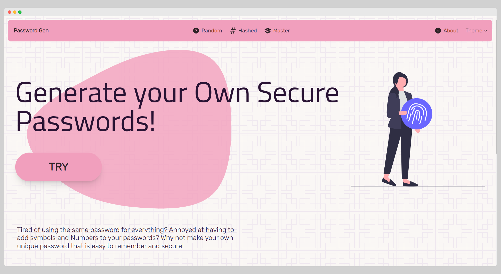
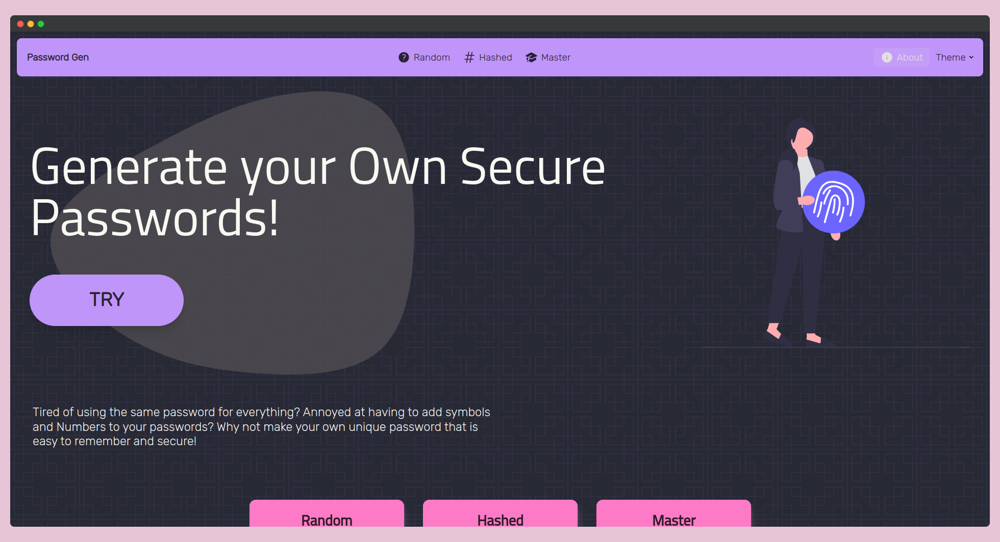

# [Password Generator](https://kptpassgen.surge.sh/)

A Custom Password Generator that I made for myself, to make it easier for me to make passwords that I can remember, while them also being secure.

# Screenshots

## Home Page

## Random Mode

## Hashed Mode

## Master Mode

## About

# Working

The Password Generator works by taking the length of the password that you want to generate and then it generates a password for you.

## Modes

There are 3 Modes:

1. Random
2. Hashed
3. Master

### Random

The Random Mode generates a random password for you. You just give the length, and if you wanna include symbols and caps or not.

### Hashed

This password is the SHA256 hash of the text you entered, along with some letters substituted with symbols and uppercase letters, if you included them. This is a secure password, but you can always generate a new one if you don't like it. As you slide the slider, you will move across the hash, thereby generating new passwords.

### Master

This password is the SHA256 hash of the text you entered, along with some letters substituted with symbols and uppercase letters, if you included them. This is a secure password, but you can always generate a new one if you don't like it. As you slide the slider, you will move across the hash, thereby generating new passwords.

The Advantage of using this method is that you only need to bother to remember your master password. The rest you can always come back and calculate on this website. Even if you do not have access to this website for whatsoever reason, you can always calculate the password yourself, as long as you remember your master password.

### Method

1. Your Master password is taken.
2. It is interleaved with the text you entered as the identifier. This text could be the name of the website, or anything else that you can remember.
3. The SHA256 hash of this interleaved string is taken.
4. The hash is then split into chunks of length equal to the password length you chose.
5. The chunk at the position you chose is taken.
6. If you chose to include symbols and uppercase letters, then a random symbol and a random uppercase letter is inserted, both at random positions in the chunk.
7. The resulting string is your password.

### Example

1. Master Password:
   rabbit
2. Identifier:
   amazon
3. Interleaved String:
   raambabziotn
4. SHA256 Hash:
   0d1ec65aa08aa40689de70630debb86b47a92f744f9f0d130087d2630e653507
5. Split into chunks of length 8:
   0d1ec65a, a08aa406, 89de7063, 0debb86b, 47a92f74, 4f9f0d13, 0087d263, 0e653507
6. Chunk at position 0:
   0d1ec65a
7. Insert random symbol and uppercase letter:
   0d1ec65a
   !
   A
8. Resulting String:
   0dAe!65a

# Usage

Just Visit [here](https://kptpassgen.surge.sh/)

# Contributing

Pull requests are welcome. For major changes, please open an issue first to discuss what you would like to change.

# License

[MIT](https://choosealicense.com/licenses/mit/)

# Credits

Huge thanks to Daisy UI, TailwindCSS, HeroIcons and ReactJS for making this easy.
